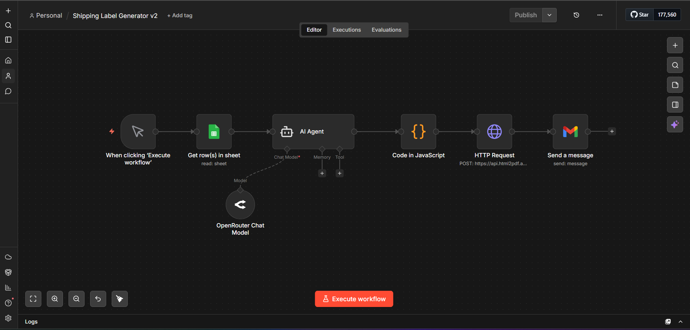
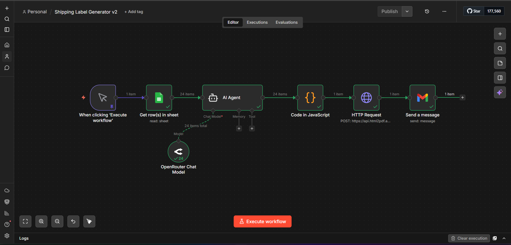

# 📦 Shipping Label Generator — N8N Automation

An automated shipping label generator built on the **N8N** workflow automation platform. It reads shipping data from Google Sheets, uses AI to process labels, generates a professional PDF (8 labels per A4 page), and emails it automatically.

---

## 🔧 Tech Stack

| Tool | Purpose |
|------|---------|
| **N8N** (Cloud) | Workflow automation engine |
| **Google Sheets** | Data source for shipping addresses |
| **OpenRouter AI** | AI module (Gemini 2.0 Flash) for label processing |
| **html2pdf.app** | HTML → PDF conversion API |
| **Gmail** | Automated email delivery |

---

## 🔀 Workflow Architecture

```
Manual Trigger → Google Sheets → AI Agent → Code → HTTP Request → Gmail
                                    ↑         (compile    (HTML→PDF)   (email)
                              OpenRouter       labels)
                              Chat Model
```

### Node Details

1. **Manual Trigger** — Starts the workflow on demand
2. **Google Sheets** — Fetches all rows from the "Shipping Labels Data" spreadsheet
3. **AI Agent** — Processes each row using OpenRouter (Gemini 2.0 Flash) to format shipping data
4. **Code (JavaScript)** — Compiles all labels into a single HTML document with:
   - 2-column grid layout
   - 8 labels per A4 page
   - Professional styling with borders, typography, and highlighted pincode
5. **HTTP Request** — Sends HTML to html2pdf.app API for PDF conversion
6. **Gmail** — Emails the generated PDF as an attachment

---

## 📋 Google Sheet Format

The source spreadsheet must have these **5 columns**:

| Name | Phone Number | Address 1 | Address 2 | Pincode |
|------|-------------|-----------|-----------|---------|
| Rahul Sharma | 9876543210 | 42, MG Road, Sector 14 | Gurugram, Haryana | 122001 |
| Priya Patel | 8765432109 | 15, Jubilee Hills, Road No. 5 | Hyderabad, Telangana | 500033 |

---

## 🏷️ Label Output

Each label includes:
- **SHIP TO** header with separator line
- **Recipient Name** (bold, large font)
- **Phone Number**
- **Address Line 1 & 2**
- **Pincode** (highlighted with grey background)

Labels are arranged in a **2×4 grid** (8 per A4 page).

---

## ⚠️ Code Node: JavaScript vs Python

The Code node is provided in **both JavaScript and Python**:

| File | Language | N8N Cloud | Self-Hosted |
|------|----------|-----------|-------------|
| `code-node.js` | JavaScript | ✅ Works | ✅ Works |
| `code-node.py` | Python | ❌ Broken | ✅ Works |

> **Why doesn't Python work on N8N Cloud?**
> N8N Cloud (v2.10.2) does not properly expose the `_input` variable in its Python sandbox.
> This is a known platform limitation — the Python option appears in the UI but the backend
> doesn't support it on Cloud. Use the JavaScript version (`code-node.js`) for Cloud deployments.
> Python works fine on self-hosted N8N instances with a native Python runtime.

---

## 🚀 Setup Instructions

### 1. Import Workflow
- Log into your N8N instance
- Go to **Workflows** → Click **⋮** menu → **Import from file**
- Select `workflow.json`

### 2. Configure Credentials

> ⚠️ **API keys are NOT included in this repo for security.**

You need to set up these credentials in N8N:

| Credential | Where to get it |
|-----------|----------------|
| **Google Sheets OAuth** | N8N → Credentials → Google Sheets → Sign in with Google |
| **OpenRouter API Key** | [openrouter.ai](https://openrouter.ai) → Dashboard → API Keys |
| **html2pdf.app API Key** | [html2pdf.app](https://dash.html2pdf.app) → API Keys |
| **Gmail OAuth** | N8N → Credentials → Gmail → Sign in with Google |

### 3. Update HTTP Request Node
In the HTTP Request node's JSON body, replace `YOUR_HTML2PDF_API_KEY` with your actual key.

### 4. Run
Click **"Execute Workflow"** → Check your email for the PDF! 📬

---

## 📁 Files

| File | Description |
|------|-------------|
| `Shipping Label Generator v2.json` | N8N workflow (sanitized, no API keys) |
| `code-node.js` | JavaScript code for Code node|
| `code-node.py` | Python code for Code node (✅ Self-Hosted only) |
| `sample-data.csv` | Sample Google Sheets data (24 rows) |
| `output/document.pdf` | Sample generated PDF output |
| `README.md` | This file |

---

## 📸 Screenshots

### Workflow Canvas


### Generated Labels (PDF)


---

## ⚙️ Environment

- **N8N Version**: 2.10.2 (Cloud)
- **AI Model**: google/gemini-2.0-flash-001 via OpenRouter
- **PDF Engine**: html2pdf.app (Free tier — 100 credits/month)

---

## 📜 License

MIT License — Feel free to use and modify.
